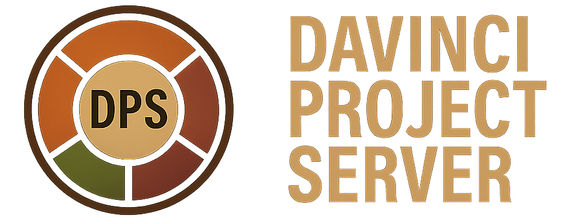

A fully portable, self-contained DaVinci Resolve Project Server environment...

--------------------------------
MISSION STATEMENT
--------------------------------

The goal of this project is to make the DaVinci Resolve Project Server accessible,
portable, and effortless for everyone who relies on it. Traditional installations
are tied to system-level dependencies, manual configuration steps, and environments
that are difficult to reproduce or move. This creates friction for creators, studios,
and technicians who need reliability, consistency, and the freedom to work across
different machines and setups.

This project exists to remove that friction.

By providing a fully portable, self-contained server environment with automated
installation, updates, backups, and restores, the project ensures that anyone can
deploy a Resolve Project Server quickly and confidently. The focus is on simplicity,
reproducibility, and long-term maintainability, without sacrificing capability or
control.

The mission is to empower users with a Resolve Project Server that is predictable,
safe, and ready to use anywhere — a tool that supports creative work instead of
getting in the way of it.

--------------------------------
FEATURES
--------------------------------

This package contains a fully portable DaVinci Resolve Project Server environment. 
It includes:

- A complete GUI and backend (Node.js)
- A PostgreSQL 15 database containing all Resolve project libraries
- Pre-built Docker images for both services
- Automated install, update, backup, restore, and uninstall scripts
- Optional Docker Compose support

This system allows deployment on any machine in minutes.

------------------------------------------------------------
CONTENTS OF davinci-complete-deployable.zip
------------------------------------------------------------

The ZIP file contains the following files:

davinci-gui-image.tar          GUI + backend Docker image
davinci-postgre-image.tar      PostgreSQL + Resolve libraries
davinci-project-folder.zip     Full project source code
install.sh                     One-command installer
update.sh                      Update script
uninstall.sh                   Clean removal script
backup.sh                      Backup script
restore.sh                     Restore script
docker-compose.yml             Optional Docker Compose configuration
README.md                      This file

------------------------------------------------------------
INSTALLATION
------------------------------------------------------------

Place install.sh and davinci-complete-deployable.zip in the same folder.

Run the following commands:

chmod +x install.sh
./install.sh

The installer will:

1. Unpack the ZIP
2. Install Docker if missing
3. Load both Docker images
4. Start the PostgreSQL container
5. Start the GUI container
6. Print the access URL

After installation, open the following address in a browser:

http://<your-ip>:8090

------------------------------------------------------------
UPDATING THE SERVER
------------------------------------------------------------

To update the GUI or backend without losing data:

1. Replace davinci-complete-deployable.zip with the new version
2. Run:

chmod +x update.sh
./update.sh

This updates only the GUI container and keeps PostgreSQL data intact.

------------------------------------------------------------
UNINSTALLING
------------------------------------------------------------

To remove everything:

chmod +x uninstall.sh
./uninstall.sh

This stops and removes:

- The GUI container
- The PostgreSQL container
- Both Docker images

Your project folder remains unless removed manually.

------------------------------------------------------------
BACKUPS
------------------------------------------------------------

To create a full backup of:

- PostgreSQL databases
- GUI container
- Project folder

Run:

chmod +x backup.sh
./backup.sh

A timestamped folder will be created:

backup_YYYY-MM-DD_HH-MM-SS/

This folder contains:

postgre-backup.tar
gui-backup.tar
project.zip

------------------------------------------------------------
RESTORING FROM BACKUP
------------------------------------------------------------

To restore from a backup folder:

chmod +x restore.sh
./restore.sh backup_YYYY-MM-DD_HH-MM-SS

This will:

1. Stop running containers
2. Load the backup images
3. Restore the project folder
4. Start both containers

------------------------------------------------------------
OPTIONAL: DOCKER COMPOSE
------------------------------------------------------------

You can run the entire system using:

docker compose up -d

The included docker-compose.yml defines:

- PostgreSQL container
- GUI container
- Automatic linking between services

------------------------------------------------------------
PROJECT STRUCTURE
------------------------------------------------------------

The project layout is as follows:

davinci-project-server/
    gui/
        app/
            public/                HTML, CSS, JavaScript files
            server.js              Backend API server
            db.js                  PostgreSQL database functions
            routes/                API route definitions
            Dockerfile             Container build file
            (other application files)

    postgres/
        (inside container)         DaVinci Resolve project libraries stored in PostgreSQL

    scripts/
        install.sh                 Automated installer
        update.sh                  Update script
        uninstall.sh               Removal script
        backup.sh                  Backup script
        restore.sh                 Restore script
        docker-compose.yml         Optional Docker Compose configuration

------------------------------------------------------------
REQUIREMENTS
------------------------------------------------------------

- Linux (Debian recommended)
- Docker Engine
- Minimum 2 GB RAM
- Minimum 5 GB free disk space

The installer will automatically install Docker if it is not already present.

------------------------------------------------------------
TROUBLESHOOTING
------------------------------------------------------------

If the GUI is not loading:
docker logs davinci-project-server-gui

If PostgreSQL is not starting:
docker logs davinci-postgre

If a port is already in use:
Modify the ports in install.sh or docker-compose.yml

------------------------------------------------------------
END OF FILE
------------------------------------------------------------

